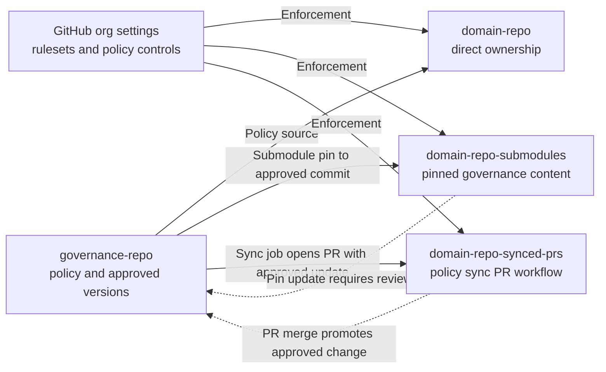

# Governance Repo

Remote:
`git@github.com:fabrice-org/governance-repo.git`

This repo is the source of truth for shared policy and approved patterns.

## Contents

- policy definitions
- template versioning rules
- field taxonomy rules
- sync policy for downstream repos
- ruleset and reviewer guidance

## Suggested structure

- `policy/`
- `rulesets/`
- `templates/`
- `sync-manifests/`

## Example files

- `policy/template-versioning-policy.md`
- `policy/domain-repo-policy.md`
- `policy/reviewer-matrix.md`
- `policy/branch-protection-baseline.md`
- `rulesets/demo-ruleset-baseline.md`
- `sync-manifests/domain-repo-pins.yml`

## How it connects

Domain repos consume approved content from this repo in one of two ways:

- submodule pinning to exact approved versions
- PR-based sync that copies approved policy into each domain repo

## Demo notes

- Configure org-level rulesets from this repo's baseline docs.
- Apply CODEOWNERS and required-reviewer routing in domain repos.
- Use this repo as the policy source, not the runtime execution location.

## Architecture Diagram

