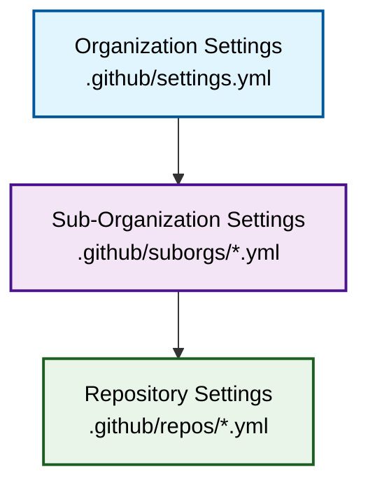
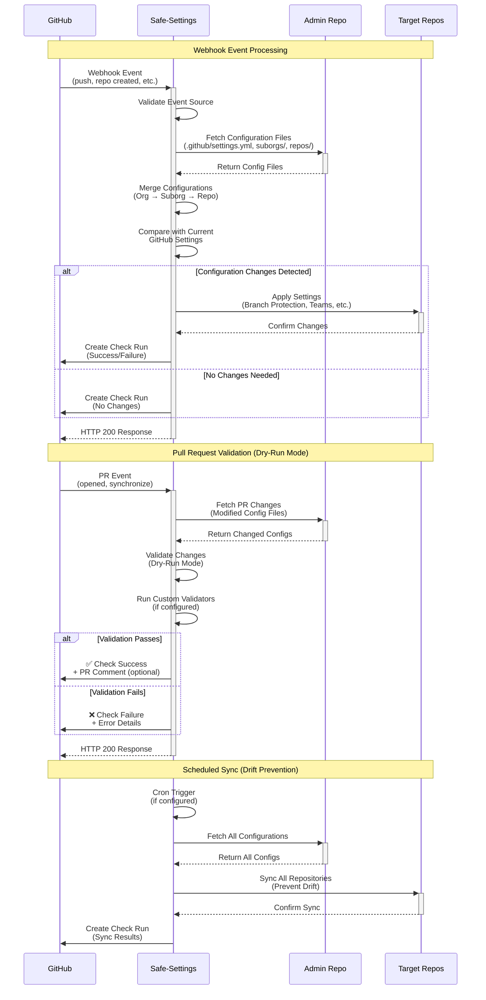

# 🛡️ GitHub Safe-Settings

[](https://github.com/github/safe-settings/actions/workflows/create-release.yml)
[](https://opensource.org/licenses/ISC)
[](https://nodejs.org/)

> **Policy-as-Code for GitHub Organizations**  
> Centrally manage and enforce repository settings, branch protections, teams, and more across your entire GitHub organization.

`Safe-settings` – an app to manage policy-as-code and apply repository settings across an organization.

1. In `safe-settings`, all the settings are stored centrally in an `admin` repo within the organization. Unlike the [GitHub Repository Settings App](https://github.com/repository-settings/app), the settings files cannot be in individual repositories.

   > It is possible specify a custom repo instead of the `admin` repo with `ADMIN_REPO`. See [Environment variables](#environment-variables) for more details.

1. The **settings** in the **default** branch are applied. If the settings are changed on a non-default branch and a PR is created to merge the changes, the app runs in a `dry-run` mode to evaluate and validate the changes. Checks pass or fail based on the `dry-run` results. The dry-run compares the PR's config against the **base branch** config, so the check run and PR comment report only the changes the PR itself introduces (see [Dry-run PR comment](#dry-run-pr-comment)).

1. In `safe-settings` the settings can have 2 types of targets:
   1. `org` - These settings are applied to the organization. `Org`-targeted settings are defined in `.github/settings.yml`. Currently, only `rulesets` are supported as `org`-targeted settings.
   1. `repo` - These settings are applied to repositories.

1. For the `repo`-targeted settings, there can be 3 levels at which the settings are managed:
   1. `Org`-level settings are defined in `.github/settings.yml`

      > It is possible to override this behavior and specify a different filename for the `settings.yml` file with `SETTINGS_FILE_PATH`. Similarly, the `.github` directory can be overridden with `CONFIG_PATH`. See [Environment variables](#environment-variables) for more details.

   1. `Suborg` level settings. A `suborg` is an arbitrary collection of repos belonging to projects, business units, or teams. The `suborg` settings reside in a yaml file for each `suborg` in the `.github/suborgs` folder.

      > In `safe-settings`, `suborgs` could be groups of repos based on `repo names`, or `teams` which the repos have collaborators from, or `custom property values` set for the repos

   1. `Repo` level settings. They reside in a repo specific yaml in `.github/repos` folder

1. It is recommended to break the settings into `org`-level, `suborg`-level, and `repo`-level units. This will allow different teams to define and manage policies for their specific projects or business units. With `CODEOWNERS`, this will allow different people to be responsible for approving changes in different projects.

> [!NOTE]
> The `suborg` and `repo` level settings directory structure cannot be customized.

## 🚀 Quick Start

Safe-Settings reads all configuration from a single **admin repository** (this repo) and applies it to every repository in the target organization. It is laid out so **any organization can reuse it**: each org gets its own folder under `.github/safe-settings/organizations/`, and you point the app at that folder with `CONFIG_PATH`.

### 1. Configuration structure

```
.github/
└── safe-settings/
    └── organizations/
        └── <org-name>/           # one folder per GitHub org (e.g. your-org)
            ├── settings.yml       # org-wide defaults applied to every repo
            ├── suborgs/           # optional: settings for groups of repos
            │   └── <suborg>.yml
            └── repos/             # per-repository overrides
                └── <repo-name>.yml
```

**Precedence is repo > suborg > org**: a value in `repos/<repo>.yml` overrides a matching `suborgs/*.yml`, which overrides `settings.yml`.

**To onboard a new org:** copy an existing `organizations/<org-name>/` folder, rename it to your org login, edit the YAML, and set `CONFIG_PATH=.github/safe-settings/organizations/<your-org>` in your environment.

### 2. Deploy options

- **🐳 Docker** — run the container locally or in your infrastructure
- **☁️ Cloud** — Heroku, Glitch, Kubernetes, or AWS Lambda
- **🖥️ Local (Node.js)** — see [Startup — Run Locally](#️-startup--run-locally) below

👉 **[All deployment options →](docs/deploy.md)**

## 🖥️ Startup — Run Locally

Try Safe-Settings against your own org before deploying it for real. Every value below uses a placeholder — nothing is tied to a specific organization.

### Prerequisites

- **Node.js 18+** (20 LTS recommended)
- A **GitHub App** installed on your org, with the permissions & events listed in [Create the GitHub App](docs/deploy.md#create-the-github-app). Download its **private key**.
- A **[smee.io](https://smee.io/new)** channel to forward webhooks to your machine.

### 1. Install dependencies

```bash
npm install
```

### 2. Configure `.env`

Create a `.env` in the repo root (it is git-ignored) and fill in your org's values:

```dotenv
GH_ORG=<your-org>                 # GitHub org login the app is installed on
APP_ID=<your-app-id>              # From the GitHub App settings page
WEBHOOK_SECRET=<your-webhook-secret>
WEBHOOK_PROXY_URL=https://smee.io/<your-channel>

# Point at the org folder you want to manage
CONFIG_PATH=.github/safe-settings/organizations/<your-org>
SETTINGS_FILE_PATH=settings.yml
ADMIN_REPO=<this-repo-name>

# Auth — path to the GitHub App private key (.pem), kept OUTSIDE the repo.
# In .env use a FULL absolute path (dotenv does NOT expand ~ or $HOME):
PRIVATE_KEY_PATH=/absolute/path/to/<your-app>.private-key.pem
GH_TOKEN=<fine-grained-PAT>       # org admin + repo permissions
```

> [!IMPORTANT]
> Never commit secrets. Keep the `.pem` **outside** the repo and lock down its permissions:
>
> ```bash
> chmod 600 "$HOME/.ssh/<your-app>.private-key.pem"
> ```
>
> Reference it with an **absolute** path in `.env` — Probot loads `.env` with plain `dotenv`, which does **not** expand `~` or `$HOME`. To use `$HOME`, export the variable in your shell instead (the shell expands it, and `dotenv` won't override an existing variable):
>
> ```bash
> export PRIVATE_KEY_PATH="$HOME/.ssh/<your-app>.private-key.pem"
> ```
>
> `.env` and `*.pem` are already covered by `.gitignore`.

### 3. Start the app

```bash
npm run dev     # local development with auto-reload
# or
npm start       # probot run ./index.js
```

Probot connects to your `WEBHOOK_PROXY_URL` automatically, so webhook events reach `http://localhost:3000/api/github/webhooks` without any extra tunnel.

### 4. Verify

- The console logs `Listening on http://localhost:3000`.
- Push a change to `settings.yml` on the admin repo's default branch, or edit a setting on a managed repo — Safe-Settings runs and creates a **`safe-settings`** check run.
- Open a PR that changes a config file to see the **dry-run** comment describing what *would* change before it is merged.

## 📊 Visual Architecture

### Configuration Hierarchy



**Precedence Order**: Repository > Sub-Organization > Organization

### Request Flow



## How it works

`Safe-settings` is designed to run as a service listening for webhook events or as a scheduled job running on some regular cadence. It can also be triggered through GitHub Actions. (See the [How to use](#how-to-use) section for details on deploying and configuring.)


### Events
The App listens to the following webhook events:

- **push**: If the settings are created or modified, that is, if  push happens in the `default` branch of the `admin` repo and the file added or changed is `.github/settings.yml` or `.github/repos/*.yml`or `.github/suborgs/*.yml`, then the settings would be applied either globally to all the repos, or specific repos. For each repo, the settings that are actually applied depend on the default settings for the org, overlaid with settings for the suborg that the repo belongs to, overlaid with the settings for that specific repo.

- **repository.created**: If a repository is created in the org, the settings for the repo - the default settings for the org, overlaid with settings for the suborg that the repo belongs to, overlaid with the settings for that specific repo - is applied.

- **branch_protection_rule**: If a branch protection rule is modified or deleted, `safe-settings` will `sync` the settings to prevent any unauthorized changes.

- **repository.edited**: For e.g. If the default branch is renamed, or if topics change, `safe-settings` will `sync` the settings, to prevent any unauthorized changes.

- **repository.renamed**: If a repository is renamed, the default behavior is safe-settings will ignore this (for backward-compatibility). If `BLOCK_REPO_RENAME_BY_HUMAN` env variable is set to true, `safe-settings` will revert the repo to the previous name unless it is renamed using a `bot`. If it is renamed using a `bot`, it will try to copy the existing `<old-repo>.yml` to `<new-repo>.yml` so that the repo config yml stays consistent. If a <new-repo.yml> file already exists, it doesn't create a new one.

- **pull_request.opened**, **pull_request.reopened**, **check_suite.requested**: If the settings are changed, but it is not in the `default` branch, and there is an existing PR, the code will validate the settings changes by running safe-settings in `nop` mode and update the PR with the `dry-run` status. The run loads the base-branch config and filters the results so only the changes the PR introduces are reported (see [Dry-run PR comment](#dry-run-pr-comment)).

- **repository_ruleset**: If the `ruleset` settings are modified in the UI manually, `safe-settings` will `sync` the settings to prevent any unauthorized changes.

- **member_change_events**: If a member is added or removed from a repository, `safe-settings` will `sync` the settings to prevent any unauthorized changes.

- **member**', __team.added_to_repository__, __team.removed_from_repository__, __team.edited__: `safe-settings` will `sync` the settings to prevent any unauthorized changes.

- __custom_property_values__: If new repository properties are set for a repository, `safe-settings` will run to so that if a sub-org config is defined by that property, it will be applied for the repo

- **repository_dispatch** (`event_type: safe-settings-generate`): Triggers the **settings generator**, which reads the current configuration of a repo/org/suborg and opens a PR against the `admin` repo with the generated YAML. See [Generating settings from existing configuration](#generating-settings-from-existing-configuration).

### Dry-run PR comment

When a config change is proposed in a PR (a non-default branch), `safe-settings` runs in `nop` (no-operation) `dry-run` mode and posts a comment summarizing what *would* change if the PR were merged. The results are filtered against the **base branch** config, so the comment reports only the changes the PR introduces — not the full diff against live GitHub settings.

The comment contains:

- A header with the run timestamp, the **number of repos considered**, and the **number of repos affected**.
- **Breakdown of changes** — a collapsible section, grouped by plugin/repo, showing field-level diffs. Each entry is marked as an addition, modification, or deletion, with the before/after values for modified fields. When there are no changes, it shows `No changes to apply.`
- **Breakdown of errors** — a collapsible section listing any errors by repo, or `None` when there are none. The check run is marked as failed when errors are present.
- **Informational messages** — a collapsible section listing non-error notices such as plugins skipped via [`disable_plugins`](#disabling-plugins-disable_plugins) or deletions suppressed by `additive_plugins`, so reviewers can see which settings were intentionally not applied.

For very large diffs the comment is split across multiple comments, and the check-run summary is truncated with a notice when it exceeds the size limit.

### Suborg re-evaluation after repo-level changes

A repo's suborg membership can depend on state that is itself written by `safe-settings`:

- `suborgteams` — repos belong to a suborg because a given team is granted access
- `suborgproperties` — repos belong to a suborg because a custom property has a given value
- `suborgrepos` — repos belong to a suborg because their name matches a glob

When a repo-level change (a push to `.github/repos/<repo>.yml`, or a `repository.created` event for a brand-new repo) adds, removes, or changes a team or custom property, the repo may start or stop matching a suborg config. A new repo may also start matching a suborg because its name matches a `suborgrepos` glob.

To handle this, after applying a repo-yml change `safe-settings` re-evaluates the repo's suborg membership. If the matched suborg source set changed, it runs the repo through the apply pipeline a second time so newly matched suborg settings are applied and settings from a no-longer-matching suborg can be removed in the same sync.

**Scope:** Re-evaluation runs only on the repo-yml change paths (`Settings.sync` and the per-repo loop of `Settings.syncSelectedRepos`). Global settings changes (`syncAll`) and suborg-yml changes (`syncSubOrgs`) already iterate all relevant repos and do not need it.

**Loop prevention.** Two guards prevent infinite re-evaluation:

1. **Stability check (primary):** Before applying changes, `safe-settings` snapshots the set of suborg source paths that match the repo. After applying, it refreshes the suborg cache and recomputes the set. If the set did not change, re-evaluation stops. If a source appeared or disappeared, the repo is processed once more.
2. **Hard depth cap (safety net):** Each repo is re-evaluated at most `MAX_REEVALUATION_DEPTH = 1` time per sync. This resolves the dominant single-hop case (repo change → suborg membership changed → apply the corrected suborg overlay once) while preventing pathological chains (suborg A applies a team that activates suborg B that activates suborg C…). Chains beyond one hop are resolved on the next sync event, and a warning is logged when the cap is hit.

**Trigger optimization.** Re-evaluation is skipped entirely when the applied repo change did not affect `teams`, `custom_properties`, repository creation, or repository rename state — these are the repo-level changes that can affect suborg matching.

### Use `safe-settings` to rename repos
If you rename a `<repo.yml>` that corresponds to a repo, safe-settings will rename the repo to the new name. This behavior will take effect whether the env variable `BLOCK_REPO_RENAME_BY_HUMAN` is set or not.

### Restricting `safe-settings` to specific repos

To restrict which repositories `safe-settings` can manage, create a `deployment-settings.yml` file. This file controls the app's scope through the `restrictedRepos` configuration:

```yml
# Using include/exclude
restrictedRepos:
  include:
    - api
    - core-*    # Matches `core-api`, `core-service`, etc.
  exclude:
    - admin
    - .github
    - safe-settings
    - test-*    # Matches `test-repo`, etc.

# Or using simple array syntax for includes
restrictedRepos: 
  - admin
  - .github
  # ...
```

> [!NOTE]
> Pattern matching uses glob expressions, e.g use * for wildcards.

When using `include` and `exclude`:

- If `include` is specified, will **only** run on repositories that match pattern(s)
- If `exclude` is specified, will run on all repositories **except** those matching pattern(s)
- If both are specified, will run only on included repositories that are'nt excluded

By default, if no configuration file is provided, `safe-settings` will excludes these repos: `admin`, `.github` and `safe-settings`.

See our [deployment-settings.yml sample](docs/sample-settings/sample-deployment-settings.yml).

### Custom rules

Admins setting up `safe-settings` can include custom rules that would be validated before applying a setting or overriding a broader scoped setting.

The code has to return `true` if validation is successful, or `false` if it isn't.

If the validation fails, the `error` attribute specified would be used to create the error message in the logs or in the `PR checks`.

The first use case is where a custom rule has to be applied for a setting on its own. For e.g. No collaborator should be given `admin` permissions.

For this type of validation, admins can provide custom code as `configvalidators` which validates the setting by itself.

For e.g. for the case above, it would look like:
```yaml
configvalidators:
  - plugin: collaborators
    error: |
      `Admin role cannot be assigned to collaborators`
    script: |
      console.log(`baseConfig ${JSON.stringify(baseconfig)}`)
      return baseconfig.permission != 'admin'
```

For convenience this script has access to a variable, `baseconfig`, that contains the setting that is be applied.

The second use case is where custom rule has to be applied when a setting in the org or suborg level is being overridden. Such as, when default branch protection is being overridden.

For this type of validation, admins can provide custom code as `overridevalidators`. The script can access two variables, `baseconfig` and `overrideconfig` which represent the base setting and the setting that is overriding it.

A sample would look like:

```yaml
overridevalidators:
  - plugin: branches
    error: |
      `Branch protection required_approving_review_count cannot be overidden to a lower value`
    script: |
      console.log(`baseConfig ${JSON.stringify(baseconfig)}`)
      console.log(`overrideConfig ${JSON.stringify(overrideconfig)}`)
      if (baseconfig.protection.required_pull_request_reviews.required_approving_review_count && overrideconfig.protection.required_pull_request_reviews.required_approving_review_count ) {
        return overrideconfig.protection.required_pull_request_reviews.required_approving_review_count >= baseconfig.protection.required_pull_request_reviews.required_approving_review_count
      }
      return true
```

A sample of `deployment-settings` file is found [here](docs/sample-settings/sample-deployment-settings.yml).

### Custom Status Checks
For branch protection rules and rulesets, you can allow for status checks to be defined outside of safe-settings together with your usual safe settings.

This can be defined at the org, sub-org, and repo level.

To configure this for branch protection rules, specify `{{EXTERNALLY_DEFINED}}` under the `contexts` keyword:
```yaml
branches:
  - name: main
    protection:
      ...
      required_status_checks:
        contexts:
          - "{{EXTERNALLY_DEFINED}}"
```

For rulesets, specify `{{EXTERNALLY_DEFINED}}` under the `required_status_checks` keyword:
```yaml
rulesets:
  - name: Status Checks
    ...
    rules:
      - type: required_status_checks
        parameters:
          required_status_checks:
            - context: "{{EXTERNALLY_DEFINED}}"
```

Notes:
  - For the same branch that is covered by multi-level branch protection rules, contexts defined at the org level are merged into the sub-org and repo level contexts, while contexts defined at the sub-org level are merged into the repo level contexts.
  - Rules from the sub-org level are merged into the repo level when their ruleset share the same name. Becareful not to define the same rule type in both levels as it will be rejected by GitHub.
  - When `{{EXTERNALLY_DEFINED}}` is defined for a new branch protection rule or ruleset configuration, they will be deployed with no status checks.
  - When an existing branch protection rule or ruleset configuration is amended with `{{EXTERNALLY_DEFINED}}`, the status checks in the existing rules in GitHub will remain as is.

> ⚠️ **Warning:**
When `{{EXTERNALLY_DEFINED}}` is removed from an existing branch protection rule or ruleset configuration, the status checks in the existing rules in GitHub will revert to the checks that are defined in safe-settings. From this point onwards, all status checks configured through the GitHub UI will be reverted back to the safe-settings configuration.

#### Referencing ruleset bypass actors and reviewers by name

Rulesets normally require numeric ids for `bypass_actors[].actor_id` and for the
team in `required_reviewers[].reviewer.id`. To avoid looking these ids up, you
can reference them by name and safe-settings resolves them to the correct id
before applying the ruleset:

- `bypass_actors[].name` — an alternative to `actor_id`. The value is resolved
  based on `actor_type`:
  - `Team` → team slug
  - `User` → username
  - `Integration` → GitHub App slug
  - `RepositoryRole` → role name. Built-in roles (`read`, `triage`, `write`,
    `maintain`, `admin`) are mapped automatically; any other name is looked up
    among the organization's custom repository roles.
- `required_reviewers[].reviewer.slug` — an alternative to `reviewer.id`, the
  slug of the reviewing team.

```yaml
rulesets:
  - name: Main protection
    target: branch
    enforcement: active
    bypass_actors:
      - name: my-team         # resolved to actor_id
        actor_type: Team
        bypass_mode: always
      - name: admin           # built-in repository role
        actor_type: RepositoryRole
        bypass_mode: always
    rules:
      - type: pull_request
        parameters:
          required_approving_review_count: 1
          dismiss_stale_reviews_on_push: false
          require_code_owner_review: false
          require_last_push_approval: false
          required_review_thread_resolution: false
          required_reviewers:
            - minimum_approvals: 1
              file_patterns: ["*.js"]
              reviewer:
                slug: my-reviewers-team   # resolved to reviewer.id
                type: Team
```

Notes:
  - This is fully backward compatible. Existing policies that use `actor_id` /
    `reviewer.id` continue to work unchanged, and numeric ids are never looked up.
  - Provide either the name (`name` / `slug`) or the id (`actor_id` /
    `reviewer.id`) for a given entry, not both. Specifying both is an error.
  - If a name cannot be resolved to an id, the ruleset sync fails with a clear
    error so the misconfiguration is surfaced rather than silently ignored.

#### Status checks inheritance across scopes
Refer to [Status checks](docs/status-checks.md).

### Performance
When there are 1000s of repos to be managed -- and there is a global settings change -- safe-settings will have to work efficiently and only make the necessary API calls.

The app also has to complete the work within an hour: the lifetime of the GitHub app token.

To address these constraints the following design decisions have been implemented:
1. `Probot` automatically handles `rate` and `abuse` limits.
2. Instead of loading all the repo contents from `.github/repos/*`, it will selectively load the specific repo file based on which `repo` settings has changed, or a subset of the repo files associated with `suborg` settings that has changed. The only time all the repo files will be loaded is if there is a `global` settings file change.
3. The PR check will only provide a summary of errors and changes. (Providing the details of changes for 1000s of repos will error out.)
4. To ensure it handles updates to GitHub intelligently, it will compare the changes with the settings in GitHub, and  will call the API only if there are `real` changes.

#### Comparing changes with GitHub
To determine if there are `real` changes, the code will generate a detailed list of `additions`, `modifications`, and `deletions` compared to the settings in GitHub:

For e.g:

If the settings is:
```json
{
  "branches": [
    {
      "name": "master",
      "protection": {
        "required_pull_request_reviews": {
          "required_approving_review_count": 2,
          "dismiss_stale_reviews": false,
          "require_code_owner_reviews": true,
          "dismissal_restrictions": {}
        },
        "required_status_checks": {
          "strict": true,
          "contexts": []
        },
        "enforce_admins": false
      }
    }
  ]
}
```

and the settings in GitHub is:
```json
{
  "branches": [
    {
      "name": "master",
      "protection": {
        "url": "https://api.github.com/repos/decyjphr-org/test/branches/develop/protection",
        "required_status_checks": {
          "url": "https://api.github.com/repos/decyjphr-org/test/branches/develop/protection/required_status_checks",
          "strict": true,
          "contexts": [],
          "contexts_url": "https://api.github.com/repos/decyjphr-org/test/branches/develop/protection/required_status_checks/contexts",
          "checks": []
        },
        "restrictions": {
          "url": "https://api.github.com/repos/decyjphr-org/test/branches/develop/protection/restrictions",
          "users_url": "https://api.github.com/repos/decyjphr-org/test/branches/develop/protection/restrictions/users",
          "teams_url": "https://api.github.com/repos/decyjphr-org/test/branches/develop/protection/restrictions/teams",
          "apps_url": "https://api.github.com/repos/decyjphr-org/test/branches/develop/protection/restrictions/apps",
          "users": [],
          "teams": [],
          "apps": []
        },
        "required_pull_request_reviews": {
          "url": "https://api.github.com/repos/decyjphr-org/test/branches/develop/protection/required_pull_request_reviews",
          "dismiss_stale_reviews": true,
          "require_code_owner_reviews": true,
          "required_approving_review_count": 2,
          "dismissal_restrictions": {
            "url": "https://api.github.com/repos/decyjphr-org/test/branches/develop/protection/dismissal_restrictions",
            "users_url": "https://api.github.com/repos/decyjphr-org/test/branches/develop/protection/dismissal_restrictions/users",
            "teams_url": "https://api.github.com/repos/decyjphr-org/test/branches/develop/protection/dismissal_restrictions/teams",
            "users": [],
            "teams": []
          }
        },
        "required_signatures": false,
        "enforce_admins": false,
        "required_linear_history": false,
        "allow_force_pushes": {
          "enabled": false
        },
        "allow_deletions": false,
        "required_conversation_resolution": false
      }
    }
  ]
}
```

the results of comparison would be:
```json
{
      "additions": {},
      "modifications": {
        "branches": [
          {
            "protection": {
              "required_pull_request_reviews": {
                "dismiss_stale_reviews": false
              }
            },
            "name": "master"
          }
        ]
      },
      "deletions": {},
      "hasChanges": true
    }
```
### Schedule
The App can be configured to apply the settings on a schedule. This could be a way to address configuration drift since webhooks are not always guaranteed to be delivered.

To periodically converge the settings to the configuration, set the `CRON` environment variable. See [Environment variables](#environment-variables) for more details.

### Pull Request Workflow
`Safe-settings` explicitly looks in the `admin` repo in the organization for the settings files. The `admin` repo could be a restricted repository with `branch protections` and `CODEOWNERS`

In that set up, when changes happen to the settings files and there is a PR for merging the changes back to the `default` branch in the `admin` repo, `safe-settings` will run `checks`  – which will run in **nop** mode and produce a report of the changes that would happen, including the API calls and the payload.

For e.g. If we have `override` validators that will fail if `org`-level branch protections are overridden at the repo or suborg level with a lesser number of required approvers, here is an screenshot of what users will see in the PR.
<p>

</p>

> [!NOTE]
> If you don't want the PR message to have these details, they can be turned off with `CREATE_PR_COMMENT`. See [Environment variables](#environment-variables) for more details.

Here is a screenshot of what the users will see in the `checkrun` page:
<p>

</p>

### Error handling
The app creates a `Check` at the end of its processing to indicate if there were any errors. The `Check` is called `safe-settings` and corresponds to the latest commit on the `default` branch of the `admin` repo.

Here is an example of a `checkrun` result:
<p>

</p>

And the `checkrun` page will look like this:
<p>

</p>

### Disabling plugins (`disable_plugins`)

Any settings file (deployment-settings, org `settings.yml`, suborg, or repo) can
contain a top-level `disable_plugins` list to turn off one or more safe-settings
plugins for a given scope. Each entry is either:

- A plugin name string (shorthand for `{ plugin: <name>, target: all }`), or
- An object `{ plugin: <name>, target: self | children | all }` (default `target: all`).

Valid plugin names: `repository`, `labels`, `collaborators`, `teams`,
`milestones`, `branches`, `autolinks`, `validator`, `rulesets`, `environments`,
`custom_properties`, `custom_repository_roles`, `variables`, `archive`.

#### Strip matrix (which source layers are removed before merge)

| Declared at                | `target: self`     | `target: children`        | `target: all`                 |
| -------------------------- | ------------------ | ------------------------- | ----------------------------- |
| deployment-settings        | deployment         | org + suborg + repo       | deployment + org + suborg + repo |
| org `settings.yml`         | org                | suborg + repo             | org + suborg + repo           |
| suborgs/`*.yml` (matched)  | suborg             | repo                      | suborg + repo                 |
| repos/`*.yml`              | repo               | (no-op)                   | repo                          |

When safe-settings builds the merged configuration for a repo, it strips the
disabled plugin's keys from the indicated source layers before merging. For
repo-level execution points (the `repository` and `archive` plugins) and
org-level execution points (`rulesets`, `custom_repository_roles`), a disable
that targets the corresponding layer also short-circuits the plugin run, and
the skip is recorded as an INFO `NopCommand` in NOP mode (PR check run).

#### Cascade rules

- **Union-only.** Strips accumulate across layers; a lower-level config can add
  more strips but can never undo a strip declared above it.
- **No re-enable.** If `disable_plugins: [labels]` is set at the org layer, a
  repo cannot re-enable `labels` for itself.

#### Important limitation

Because strips operate on **source layers**, a lower-level disable cannot
remove configuration contributed by a higher layer. For example, if `branches`
is defined at the org layer and a suborg adds
`disable_plugins: [{plugin: branches, target: all}]`, the suborg's strip
removes the `branches` key only from the suborg and repo layers — the org's
`branches` config still merges in, and the branches plugin still runs.

To fully suppress a plugin for matched repos, declare the disable at (or above)
the layer that contributes the configuration — typically the org layer with
`target: all`, or at the deployment layer.

#### Examples

Org `settings.yml` — disable `custom_repository_roles` only at the org execution
point (rulesets still run):

```yaml
disable_plugins:
  - plugin: custom_repository_roles
    target: self
```

Org `settings.yml` — disable `branches` everywhere (shorthand):

```yaml
disable_plugins:
  - branches
```

Suborg `suborgs/team-x.yml` — strip `labels` for matched repos (effective only
if `labels` is not also defined at the org layer):

```yaml
disable_plugins:
  - plugin: labels
    target: all
```

### Additive plugins (`additive_plugins`)

`additive_plugins` is the complementary "soft mode" to `disable_plugins`. When a
Diffable plugin is listed here, safe-settings will only **add** and **update**
entries — it will **never call `remove()`**. Items that exist on GitHub but are
absent from the YAML are preserved, effectively merging external changes with
your policy rather than overwriting them.

Declare `additive_plugins` only in `settings.yml` (org level) to keep behaviour
consistent across all repositories.

**Supported plugins** (all extend `Diffable`):

| Plugin | Effect in additive mode |
|--------|------------------------|
| `labels` | Extra labels not in YAML are kept |
| `collaborators` | Extra collaborators not in YAML are kept |
| `teams` | Extra team permissions not in YAML are kept |
| `milestones` | Extra milestones not in YAML are kept |
| `autolinks` | Extra autolinks not in YAML are kept |
| `environments` | Extra environments not in YAML are kept |
| `custom_properties` | Extra property values not in YAML are kept |
| `variables` | Extra variables not in YAML are kept |
| `rulesets` | Extra rulesets not in YAML are kept |
| `custom_repository_roles` | Extra custom roles not in YAML are kept |

> [!important]
> `repository`, `archive`, `branches`, and `validator` are **not** supported.
> Listing them in `additive_plugins` will produce a validation error.

**NOP mode**: when `additive_plugins` is active and the diff would produce
deletions, an informational message — *"Additive mode active: N deletion(s)
suppressed by additive_plugins"* — is included in the PR check-run comment so
reviewers can see what is being preserved.

**Example** — never delete labels or collaborators that were added outside of
safe-settings:

```yaml
additive_plugins:
  - labels
  - collaborators
```

### The Settings Files

The settings files can be used to set the policies at the `org`, `suborg` or `repo` level.

The following can be configured:

- `Repository settings` - home page, url, visibility, has_issues, has_projects, wikis, etc.
- `Default branch` - naming and renaming
- `Topics`
- `Custom properties`
- `Teams and permissions`
- `Collaborators and permissions`
- `Issue labels`
- `Milestones`
- `Branch protections` - if the name of the branch is `default` in the settings, it is applied to the `default` branch of the repo.
- `Autolinks`
- `Repository name validation` using regex pattern
- `Rulesets`
- `Environments` - wait timer, required reviewers, prevent self review, protected branches deployment branch policy, custom deployment branch policy, variables, deployment protection rules

See [`docs/sample-settings/settings.yml`](docs/sample-settings/settings.yml) for a sample settings file.

> [!note]
> When using `collaborators`, `teams` or `labels`, you can control which repositories they apply to using `include` and `exclude`:
>
> - If `include` is specified, settings will **only** apply to repositories that match those patterns
> - If `exclude` is specified, settings will apply to all repositories **except** those matching the patterns  
> - If both are specified, `exclude` takes precedence over `include` but `include` patterns will still be respected
>
> Pattern matching uses glob expressions, e.g use * for wildcards. For example:
>
> ```yml
> teams:
>   - name: Myteam-admins
>     permission: admin
>   - name: Myteam-developers
>     permission: push
>   - name: Other-team
>     permission: push
>     include:
>       - '*-config'
>  ```

### Additional values

In addition to the values in the file above, the settings file can have some additional values:

1. `force_create`: This is set in the repo-level settings to force create the repo if the repo does not exist.
2. `template`: This is set in the repo-level settings, and is used with the `force_create` flag to use a specific repo template when creating the repo
3. `suborgrepos`: This is set in the suborg-level settings to define an array of repos. This field can also take a `glob` pattern to allow wild-card expression to specify repos in a suborg. For e.g. `test*` would include `test`, `test1`, `testing`, etc.
4. The `suborgteams` section contains a list of teams, and all the repos belonging to the teams would be part of the `suborg`


### Environment variables

You can pass environment variables; the easiest way to do it is via a `.env` file.

1. `CRON` you can pass a cron input to run `safe-settings` at a regular schedule. This is based on [node-cron](https://www.npmjs.com/package/node-cron). For eg.
  ```
  # ┌────────────── second (optional)
  # │ ┌──────────── minute
  # │ │ ┌────────── hour
  # │ │ │ ┌──────── day of month
  # │ │ │ │ ┌────── month
  # │ │ │ │ │ ┌──── day of week
  # │ │ │ │ │ │
  # │ │ │ │ │ │
  # * * * * * *
  CRON=* * * * * # Run every minute
  ```
1. Logging level can be set using `LOG_LEVEL`. For e.g.
  ```
  LOG_LEVEL=trace
  ```
1. Configure the source repository using `ADMIN_REPO` (default is `admin`). For e.g.
  ```
  ADMIN_REPO=safe-settings-config
  ```
1. Configure the config path using `CONFIG_PATH` (default is `.github`). For e.g.
  ```
  CONFIG_PATH=.github
  ```
1. Configure the settings file path using `SETTINGS_FILE_PATH` (default is `settings.yml`). For e.g.
  ```
  SETTINGS_FILE_PATH=settings.yml
  ```
1. Configure the deployment settings file path using `DEPLOYMENT_CONFIG_FILE` (default is `deployment-settings.yml`). For e.g.
  ```
  DEPLOYMENT_CONFIG_FILE=deployment-settings.yml
  ```
1. Enable the pull request comment using `ENABLE_PR_COMMENT` (default is `true`). For e.g.
  ```
  ENABLE_PR_COMMENT=true
  ```
1. Block repository renaming manually using `BLOCK_REPO_RENAME_BY_HUMAN` (default is `false`). For e.g.
  ```
  BLOCK_REPO_RENAME_BY_HUMAN=true
  ```


### Runtime Settings

1. Besides the above settings files, the application can be bootstrapped with `runtime` settings.
2. The `runtime` settings are configured in `deployment-settings.yml` that is in the directory from where the GitHub app is running.
3. Currently the only setting that is possible are `restrictedRepos: [... ]` which allows you to configure a list of repos within your `org` that are excluded from the settings. If the `deployment-settings.yml` is not present, the following repos are added by default to the `restricted`repos list: `'admin', '.github', 'safe-settings'`


### Notes

1. Label color can also start with `#`, e.g. `color: '#F341B2'`. Make sure to wrap it with quotes!
1. Each top-level element under branch protection must be filled (eg: `required_pull_request_reviews`, `required_status_checks`, `enforce_admins` and `restrictions`). If you don't want to use one of them you must set it to `null` (see comments in the example above). Otherwise, none of the settings will be applied.
2. The precedence order is repository > suborg > org (.github/repos/*.yml > .github/suborgs/*.yml > .github/settings.yml


## How to use

1. Create an `admin` repo (or an alternative of your choosing) within your organization. Remember to set `ADMIN_REPO` if you choose something other than `admin`. See [Environment variables](#environment-variables) for more details.

2. Add the settings for the `org`, `suborgs`, and `repos`. Sample files can be found [here](docs/sample-settings).

3. __[Deploy and install the app](docs/deploy.md)__.  Alternatively, the __[GitHub Actions Guide](docs/github-action.md)__ describes how to run `safe-settings` with GitHub Actions.

## Smoke Testing

The repository includes an end-to-end smoke test script (`smoke-test.js`) that validates safe-settings against a live GitHub organization. It starts the app, creates repos/configs via the API, and verifies that safe-settings correctly applies and enforces settings.

### Prerequisites

- **Node.js** (same version used to run safe-settings)
- **`gh` CLI** — authenticated and available on PATH (used for drift-remediation tests only)
- A **GitHub App** installed on the target org with the required permissions
- A `.env` file in the project root (see below)

### Authentication

The smoke test uses **two authentication methods**:

- **GitHub App token** (via `APP_ID` + `PRIVATE_KEY`) — used for the majority of tests: creating configs, merging PRs, validating repos, teams, rulesets, custom properties, etc.
- **Fine-grained PAT** (via `GH_TOKEN`) — used **only** in Phase 2 (team removal) and Phase 3 (rogue ruleset creation). These drift-remediation tests must appear as a human action because safe-settings ignores webhook events where `sender.type` is `Bot`.

### Configuration

Add the following to your `.env` file:

| Variable | Description | Required |
|---|---|---|
| `GH_ORG` | Target GitHub organization (e.g. `my-org`) | Yes |
| `APP_ID` | GitHub App ID | Yes |
| `PRIVATE_KEY` | GitHub App private key (use `\n` for newlines) | Yes |
| `WEBHOOK_PROXY_URL` | Smee.io proxy URL for webhooks | Yes |
| `ADMIN_REPO` | Admin repo name (default: `admin`) | No |
| `CONFIG_PATH` | Config path within admin repo (default: `.github`) | No |
| `GH_TOKEN` | Fine-grained PAT with org admin + repo permissions | Yes |
| `SMOKE_VERBOSE` | Set to `1` to show live safe-settings logs | No |

### Running

```bash
# Run all phases
npm run smoke-test
# or
node smoke-test.js

# Interactive mode — pause after each phase for manual validation
npm run smoke-test:interactive
# or
node smoke-test.js --interactive

# Run a single phase (with setup + teardown)
npm run smoke-test:phase -- 3
# or
node smoke-test.js --phase 3

# Run a range of phases
npm run smoke-test:phase -- 1-3
node smoke-test.js --phase 1-3

# Run specific comma-separated phases
npm run smoke-test:phase -- 1,3,5
node smoke-test.js --phase 1,3,5

# Mix range + interactive
npm run smoke-test:phase -- 1-3 interactive
node smoke-test.js --phase 1-3 --interactive
```

### What it tests

The smoke test runs the following phases:

| Phase | Description |
|---|---|
| **Setup** | Initializes the admin repo with an empty `settings.yml`, removes stale test repos, and starts safe-settings |
| **Phase 1** | Creates a repo config (`test`), validates NOP mode via check runs, merges, and verifies repo creation, teams, custom properties, and rulesets |
| **Phase 2** | Removes a team from the repo and verifies safe-settings re-adds it (drift remediation) |
| **Phase 3** | Creates a rogue ruleset and verifies safe-settings removes it (drift remediation) |
| **Phase 4** | Creates `demo-repo-service1` with teams, topics, and branch protection |
| **Phase 5** | Creates a property-targeted suborg config, verifies suborg rulesets apply to two matching repos, then changes one repo's custom property and verifies the ruleset is removed only from the repo that no longer matches |
| **Phase 6** | Archives `demo-repo-service1` and verifies the repo is archived |
| **Phase 7** | Creates `demo-repo-service2` and verifies suborg rulesets are inherited |
| **Phase 7b** | Tests external group team sync |
| **Phase 8** | Creates org-level settings (custom repository roles + org rulesets) and verifies they are applied |
| **Phase 10** | Validates `disable_plugins` — ensures disabled plugins are skipped |
| **Phase 11** | Validates `additive_plugins` — verifies additive-mode plugin behaviour |
| **Phase 12** | Tests `custom_properties` plugin |
| **Phase 13** | Tests the `variables` plugin (create, update, remove variables) |
| **Teardown** | Shuts down safe-settings, deletes test repos, teams, custom roles, and rulesets |

### Output

The script uses colored terminal output with pass (✅) / fail (❌) indicators and prints a summary at the end:

```
══════════════════════════════════════
  Results: 45 passed, 0 failed
══════════════════════════════════════
```


## Generating settings from existing configuration

Safe-settings normally works "forward": you declare settings in YAML and it applies them to GitHub. The **settings generator** does the reverse — it reads the *current* state of a repo, an org, or a collection of repos (a suborg) and produces the corresponding safe-settings YAML (`repos/<name>.yml`, `settings.yml`, or `suborgs/<name>.yml`). This is useful for onboarding existing repositories/orgs onto safe-settings without hand-authoring config.

It can be invoked two ways:

- **Standalone CLI** (`generate-settings.js`) — writes the generated file to your local filesystem.
- **App trigger** via a `repository_dispatch` event — the running app generates the file and opens a **pull request** against the admin repo.

### Source types

| `source_type` | `source_value` | What is extracted | Output file |
|---|---|---|---|
| `repo` | repository name | All repo-level plugins (repository, labels, collaborators, teams, milestones, branches, autolinks, custom_properties, variables, environments, repo rulesets) | `repos/<repo>.yml` |
| `org` | org login | Org-level rulesets and custom repository roles only | `settings.yml` |
| `custom-property` | `name=value` (e.g. `Team=backend`) | Repo-level settings **common to all repos** carrying that custom property value (intersection) | `suborgs/<name>_<value>.yml` |

> **Note on suborgs:** for `custom-property`, the generator discovers every repo with the given custom property value, extracts each repo's config, and keeps only the settings that are **identical across all of them**. A `suborgproperties` selector is prepended automatically.

### Overwrite behavior

By default (`overwrite=false`) the generator will **not** replace an existing file. If the target already exists it writes a `<name>.sample.yml` file next to it instead. Set `overwrite=true` to replace the file.

### Standalone invocation

The CLI loads variables from a `.env` file in the project root (`APP_ID`, `PRIVATE_KEY`, and optionally `GH_ORG`/`OWNER`). Options can be passed as flags or environment variables.

```bash
# Generate repos/my-repo.yml from a single repository
node generate-settings.js \
  --source-type repo \
  --source-value my-repo \
  --owner my-org \
  --output-dir ./out

# Generate settings.yml from org-level rulesets + custom repository roles
node generate-settings.js --source-type org --source-value my-org --output-dir ./out

# Generate suborgs/Team_backend.yml from all repos with the custom property Team=backend
node generate-settings.js \
  --source-type custom-property \
  --source-value "Team=backend" \
  --owner my-org \
  --output-dir ./out

# Overwrite an existing file instead of writing a .sample.yml
node generate-settings.js --source-type repo --source-value my-repo --owner my-org --overwrite

# Using environment variables instead of flags
SOURCE_TYPE=repo SOURCE_VALUE=my-repo OWNER=my-org OUTPUT_DIR=./out node generate-settings.js
```

| Flag | Env var | Description | Default |
|---|---|---|---|
| `--source-type` | `SOURCE_TYPE` | `repo`, `org`, or `custom-property` | (required) |
| `--source-value` | `SOURCE_VALUE` | repo name / org login / `name=value` | (required) |
| `--property-name` | `SOURCE_PROPERTY_NAME` | Custom property name (alternative to encoding it in `--source-value`) | — |
| `--owner` | `OWNER` / `GITHUB_ORG` / `GH_ORG` | Org login (selects the matching App installation) | first installation |
| `--output-dir` | `OUTPUT_DIR` | Directory to write generated files into | `.` |
| `--overwrite` | `OVERWRITE=true` | Replace existing files instead of writing `.sample.yml` | `false` |

### App invocation (`repository_dispatch`)

When the app is running, trigger generation by sending a `repository_dispatch` event (with `event_type: safe-settings-generate`) to the **admin repo**. The app generates the file and opens a PR against the admin repo's default branch.

```bash
# Generate a repo config and open a PR
gh api --method POST \
  /repos/my-org/admin/dispatches \
  -f event_type=safe-settings-generate \
  -F 'client_payload[source_type]=repo' \
  -F 'client_payload[source_value]=my-repo' \
  -F 'client_payload[overwrite]=false'

# Generate org-level settings.yml and open a PR
gh api --method POST \
  /repos/my-org/admin/dispatches \
  -f event_type=safe-settings-generate \
  -F 'client_payload[source_type]=org' \
  -F 'client_payload[source_value]=my-org'

# Generate a suborg config from a custom property
gh api --method POST \
  /repos/my-org/admin/dispatches \
  -f event_type=safe-settings-generate \
  -F 'client_payload[source_type]=custom-property' \
  -F 'client_payload[source_value]=Team=backend' \
  -F 'client_payload[overwrite]=false'
```

The `client_payload` fields are:

| Field | Description | Required |
|---|---|---|
| `source_type` | `repo`, `org`, or `custom-property` | Yes |
| `source_value` | repo name / org login / `name=value` | Yes |
| `property_name` | Custom property name (alternative to encoding it in `source_value`) | No |
| `overwrite` | `true` to replace an existing file; otherwise a `.sample.yml` is created | No (default `false`) |

> **Tip:** Always review the generated PR before merging. Running safe-settings in NOP mode against the generated config should report no unexpected diffs.

#### Generated changes always go through a pull request

The app **never** commits generated configuration directly to the admin repo's default branch. Every `repository_dispatch` invocation produces a pull request that must be reviewed and merged before it takes effect. Concretely, for each request the app:

1. Creates a **new branch** off the admin repo's default branch (`safe-settings-generate/<source_type>-<source_value>-<timestamp>`).
2. Commits the generated YAML **to that branch only**.
3. Opens a **pull request** from that branch against the default branch.

This means it is safe to give developers write access to the admin repo so they can trigger generation: a `repository_dispatch` event can only create a branch and open a PR — it cannot change the live configuration on its own. The generated config does not reach the path safe-settings acts on until the PR is merged, so all changes are subject to your normal review process and any branch protection / required-reviews rules configured on the admin repo's default branch.

To enforce review, protect the admin repo's default branch (for example, require pull request reviews and disallow direct pushes). Because the generator only ever writes to a feature branch and opens a PR, those rules apply to every generated change.


## License

`safe-settings` is licensed under the [ISC license](https://github.com/github/safe-settings/blob/master/LICENSE)

`safe-settings` uses 3rd party libraries, each with their own license. These are found [here](https://github.com/github/safe-settings/blob/master/NOTICE.md).


[dependabot-link]: https://dependabot.com/

[dependabot-badge]: https://badgen.net/dependabot/probot/settings/?icon=dependabot

[github-actions-ci-link]: https://github.com/probot/settings/actions?query=workflow%3A%22Node.js+CI%22+branch%3Amaster

[github-actions-ci-badge]: https://github.com/probot/settings/workflows/Node.js%20CI/badge.svg
