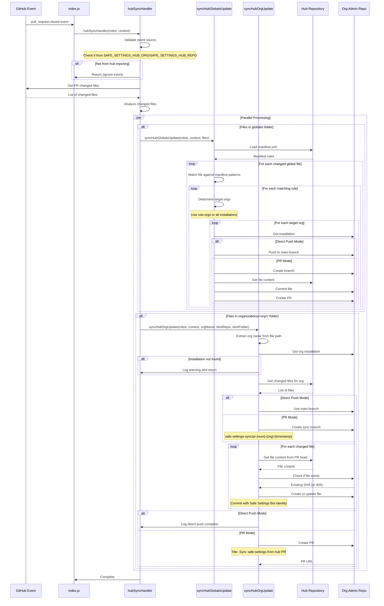
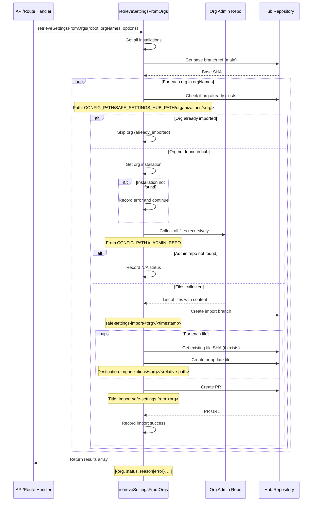
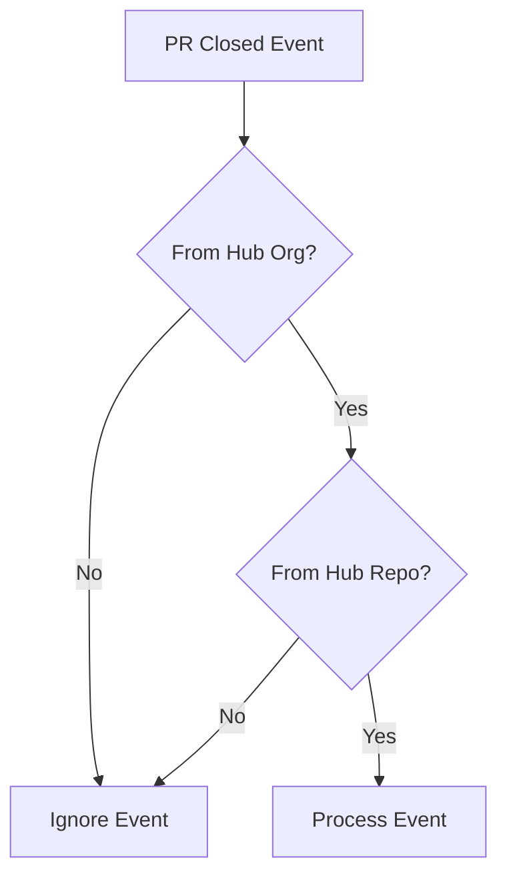
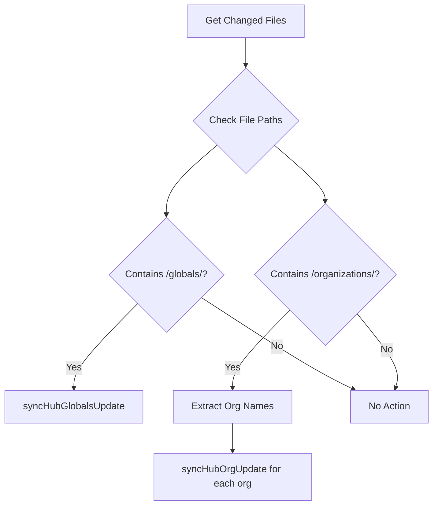
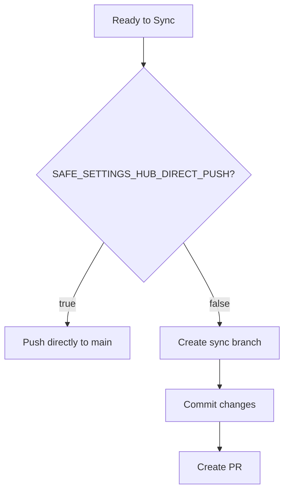

# HubSyncHandler Architecture - Sequence Diagram

This document provides a detailed sequence diagram showing the flow of the Hub Sync Handler, which synchronizes safe-settings configurations between a centralized hub repository and organization-specific admin repositories.

## Main Flow

## Reverse Flow: Import Settings from Orgs to Hub

## Key Decision Points

### Event Validation

### File Routing Logic

### Sync Mode Decision

## Environment Variables

| Variable | Purpose | Used In |
|----------|---------|---------|
| `SAFE_SETTINGS_HUB_ORG` | Hub organization name | Event validation |
| `SAFE_SETTINGS_HUB_REPO` | Hub repository name | Event validation |
| `SAFE_SETTINGS_HUB_PATH` | Base path in hub (e.g., "safe-settings") | File path resolution |
| `ADMIN_REPO` | Target repo name in orgs | Destination repo |
| `CONFIG_PATH` | Config folder (e.g., ".github") | File path resolution |
| `SAFE_SETTINGS_HUB_DIRECT_PUSH` | Push mode ("true"/"false") | Branch vs direct push |

## Error Handling

All functions implement try-catch blocks with logging:
- **Installation errors**: Log warning and skip org
- **File read errors**: Log error and continue with next file
- **PR creation errors**: Log error and throw (stops sync for that org)
- **Repository not found**: Record as "N/A" status and continue

## Notes

- **Parallel Processing**: `syncHubGlobalsUpdate` and `syncHubOrgUpdate` can run in parallel if both globals and organizations folders have changes
- **Authentication**: Each org requires a separate authenticated octokit client via `robot.auth(installationId)`
- **File Logging**: All operations are logged to `hubSyncHandler.log` (configurable)
- **Idempotency**: Functions check for existing branches/PRs before creating new ones
